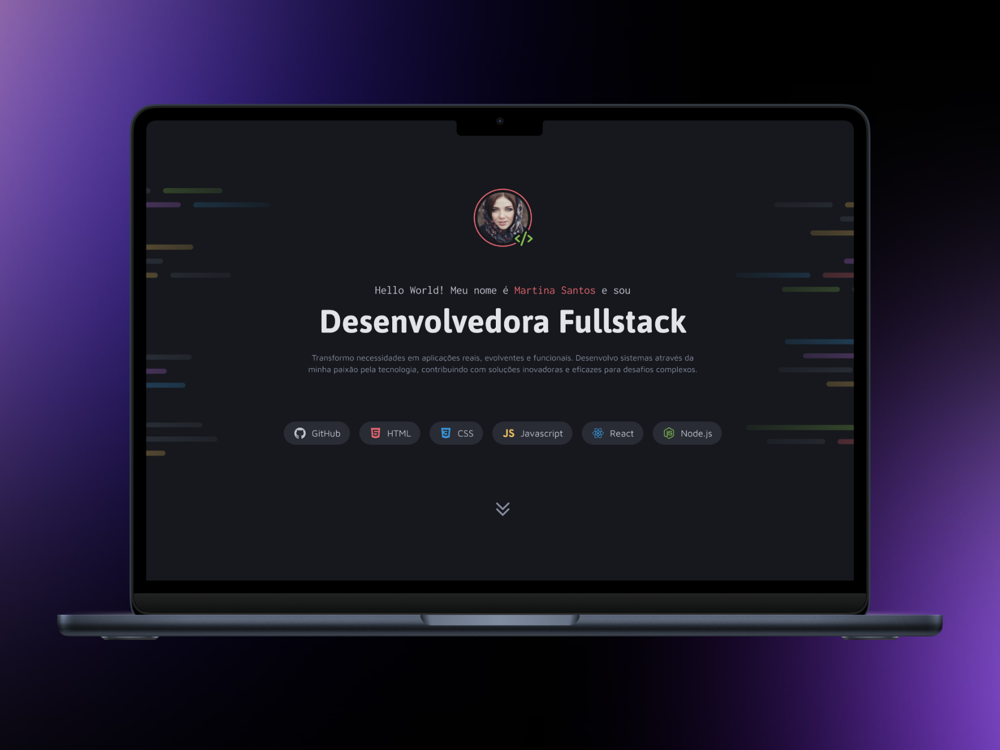

# Portfólio para Desenvolvedores - Desafio Rocketseat

## 📝 Descrição

Site de portfólio desktop para desenvolvedores, com seções para exibir projetos profissionais e informações de contato. Este projeto faz parte dos **desafios práticos da Formação Fullstack da Rocketseat**, desenvolvido para ajudar estudantes a aplicar conceitos de desenvolvimento web em um cenário real.

---

## 🛠️ Tecnologias Utilizadas

- **HTML5**: Estrutura semântica para acessibilidade e SEO.
- **CSS3**: Flexbox/Grid para layouts, animações e responsividade.
- **JavaScript**: Interatividade (validação de formulário, scroll suave).
- **Git**: Controle de versão e colaboração.
